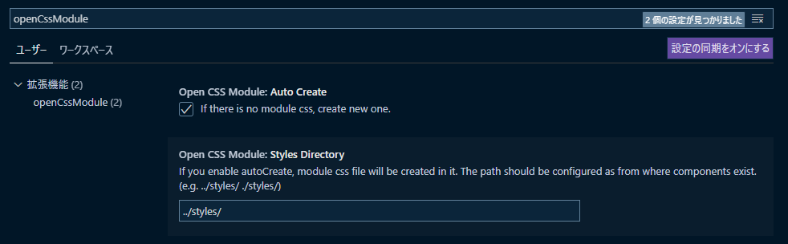

## Features

While editing a JSX or TSX file, you can open the corresponding css module file.

## Usage

After install this extension, just open the command palette (<kbd>Ctrl</kbd>+<kbd>Shift</kbd>+<kbd>P</kbd>) and choose `open css module` or `open css module (Beside)`.

## Setting

Open setting (<kbd>Ctrl</kbd> + <kbd>,</kbd>) and open `OpenCssModule` tab.
You can enable **Auto Create** function.

Auto Create allows create new files when there are no css modules.
Set the **Styles Directory** as the directory where the files should be created.

## Updates

### 0.0.4

- fix import sentence when Styles Directory is set to './' or '.'

### 0.0.3

- fix message

### 0.0.2

- add autoCreate method
- refactor code

### 0.0.1

- First Release

-----------------------------------------------------------------------------------------------------------