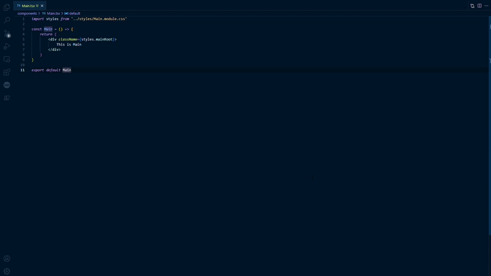

## Features

While editing a JSX or TSX file, you can open the corresponding css module file.

## Usage

After install this extension, just open the command palette (<kbd>Ctrl</kbd>+<kbd>Shift</kbd>+<kbd>P</kbd>) and choose `open css module` or `open css module (Beside)`.

### 0.0.1

First Release

-----------------------------------------------------------------------------------------------------------